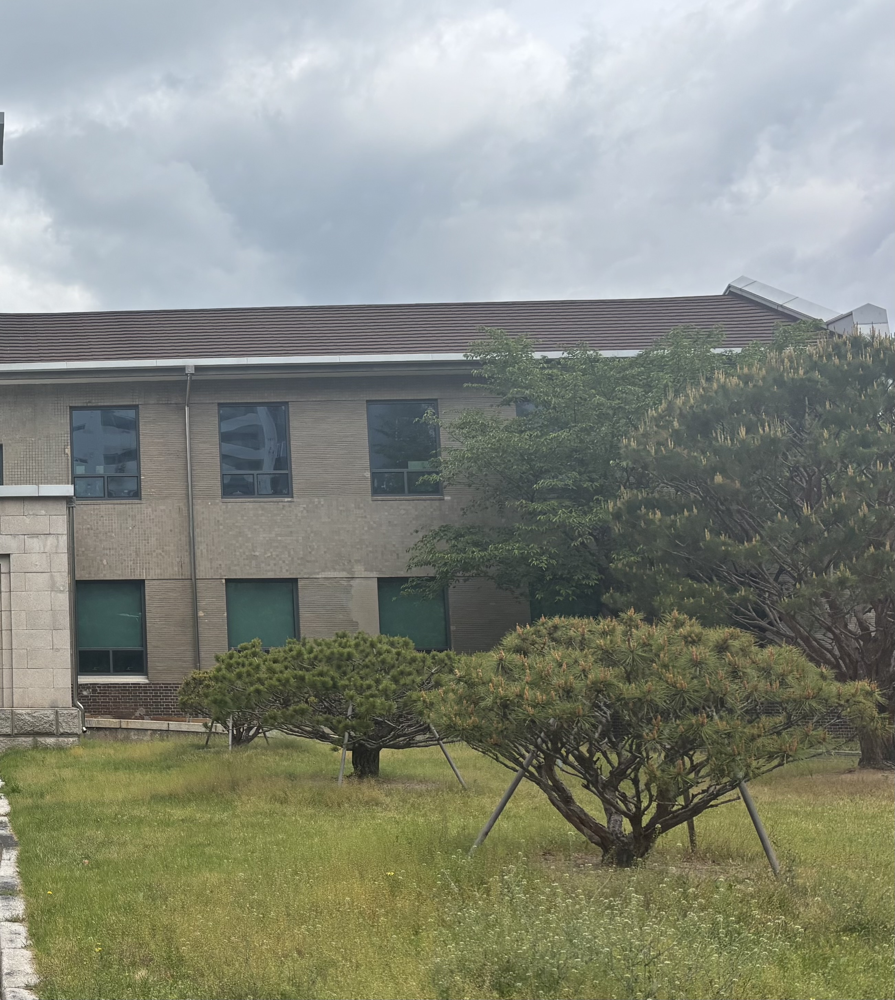
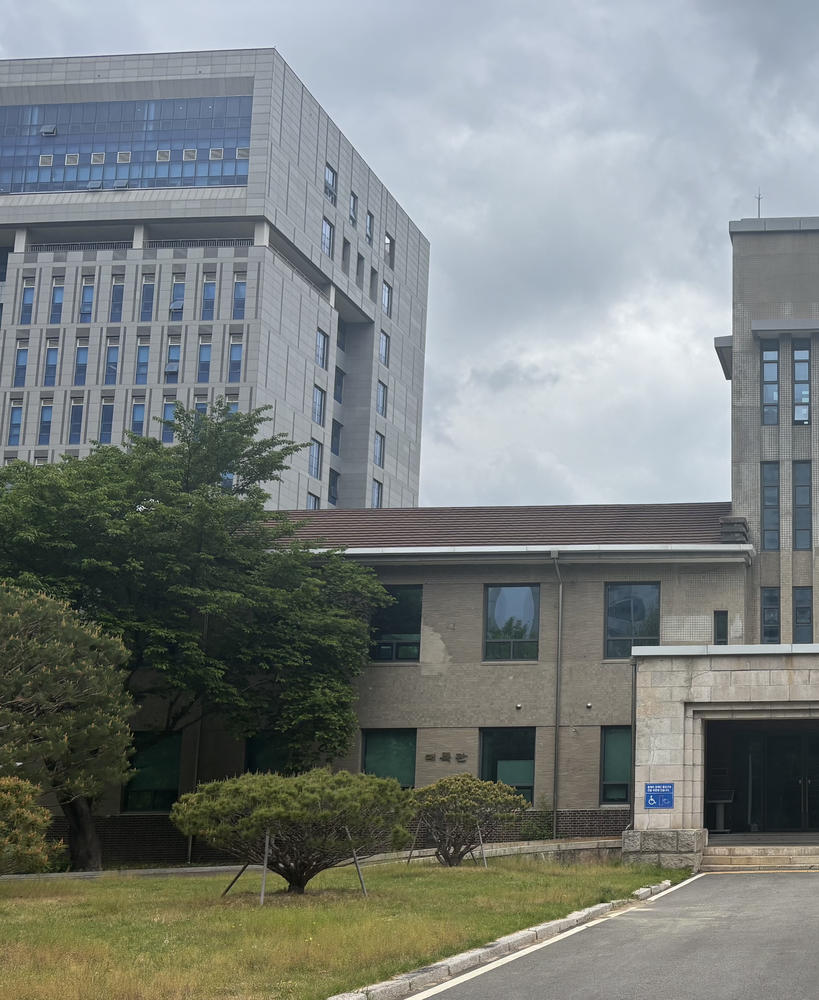
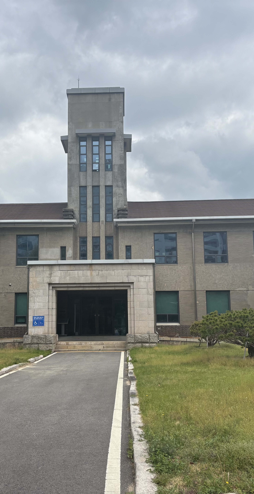
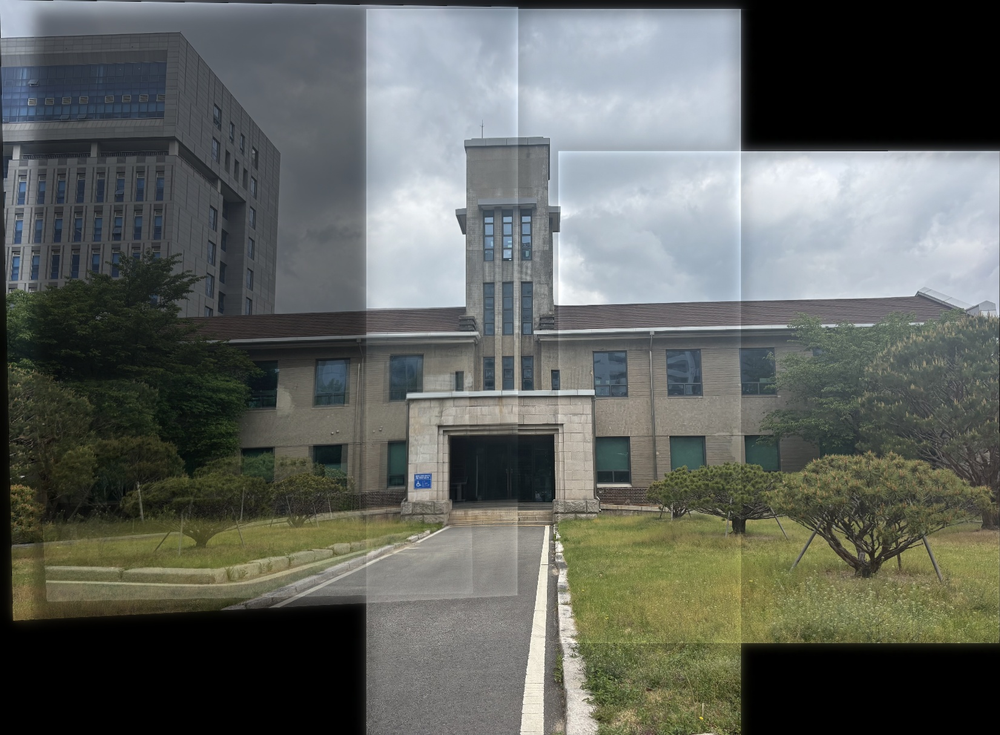

# PanoramaForge 

**여러 장의 겹치는 사진을 하나의 매끄러운 파노라마 이미지로 자동 합성하는 프로그램**

---

## 주요 기능

- **자동 특징점 검출** — SIFT(Scale-Invariant Feature Transform) 사용
- **강건한 매칭** — FLANN 매처 + Lowe's ratio test로 오매칭 제거
- **RANSAC 기반 호모그래피 추정** — 아웃라이어 제거
- **멀티밴드 블렌딩** — 라플라시안 피라미드를 이용한 자연스러운 경계 처리 *(추가 기능)*
- **자동 스티칭 순서 결정** — 매칭 수 기반으로 최적 순서 자동 탐색
- **검은 테두리 자동 크롭** — 스티칭 후 불필요한 여백 제거

---

## 사용법

### 이미지 직접 지정

```bash
python image_stitching.py img1.jpg img2.jpg img3.jpg
```

### 폴더 내 이미지 전체 스티칭

```bash
python image_stitching.py --dir ./my_photos --output panorama.jpg
```

### 데모 실행 (이미지 없이 테스트 가능)

```bash
python image_stitching.py --demo
```

---

## 추가 기능: 멀티밴드 블렌딩

일반적인 알파 블렌딩은 이미지 경계에 눈에 띄는 이음새가 생깁니다.  
본 프로젝트는 **라플라시안 피라미드 기반 멀티밴드 블렌딩**을 구현하여 이를 해결합니다.

- **고주파 성분** (엣지, 텍스처) → 좁은 전환 구간으로 블렌딩 → 선명한 디테일 유지
- **저주파 성분** (색상, 밝기) → 넓은 전환 구간으로 블렌딩 → 자연스러운 색상 전환

노출 차이가 있는 이미지에서도 고스팅(ghosting) 없이 자연스러운 파노라마를 생성합니다.

---

## 결과 예시

### 입력 이미지

| img1 | img2 | img3 | img4 |
|------|------|------|------|
|  |  |  |  |

### 출력 파노라마



---

## 촬영 팁

- 인접한 이미지 간 **30~50% 오버랩** 확보
- 카메라 위치 고정 후 **회전만** 하여 촬영 (플래너 호모그래피 조건)
- 전경/배경의 **깊이 차이가 크지 않은** 장면 선택
- **일정한 조명** 조건에서 촬영

---

## 라이선스

MIT
